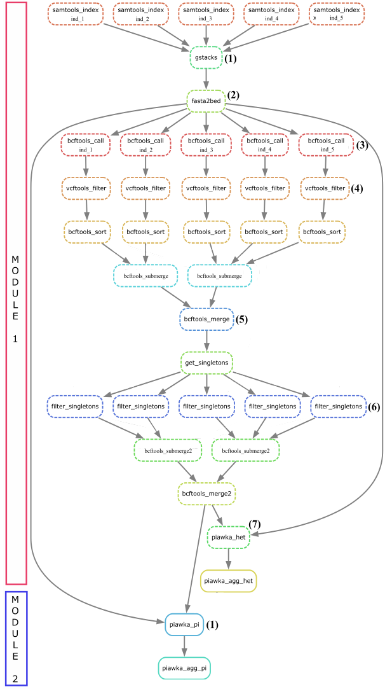

# JeDi

A Snakemake pipeline to calculate unbiased genetic diversity metrics: individual heterozygosity, population nucleotide diversity (π) and populations sequence divergence (dxy). JeDi avoids common pitfalls that lead to biased genetic diversity estimates (e.g., it keeps and accounts for tri- and tetra-allelic sites and invariant [monomorphic] sites, which is essential for the correct computation of π and dxy).

1. [Quick Start with Docker](#quick-start-with-docker)
2. [Installation and Configuration](#installation-and-configuration)
3. [Output](#output)
4. [Citation](#citation)

<div align="center">

</div>

## Quick Start with Docker

The easiest way to run JeDi is with Docker, which handles all dependencies automatically.

**Requirements:**
- Docker installed ([Get Docker](https://www.docker.com/get-started))
- Your data organized in a directory (see [Data Organization](#data-organization) below)

**Quick Start:**

1. Clone the repository:

```sh
git clone https://github.com/drobledoruiz/JeDi
cd JeDi
```

2. Organize your data in a directory with:
   - BAM files (e.g., `sample1.bam`, `sample2.bam`)
   - Reference genome (e.g., `reference.fa`)
   - Population mapping file (e.g., `id_pop.txt`)

3. Run the pipeline:

```sh
# Sample Analysis
make sample_analysis DATA=/path/to/your/data

# Population Analysis (uses Sample Analysis output)
make population_analysis DATA=/path/to/your/data
```

Results will be in `/path/to/your/data/output/`

## Installation and Configuration

### Data Organization

Your input directory should contain:

**Required files:**
1. **Reference genome**: `*.fa` or `*.fasta` file
2. **Population mapping**: `id_pop*.txt` file with two tab-separated columns (sample ID, population)
   - Example: `A0119  PopA`
3. **BAM files**: One per sample, named with sample IDs (e.g., `A0119.bam`)

**Example structure:**
```
/my_data/
├── reference.fa
├── id_pop.txt
├── A0119.bam
├── A0126.bam
└── A0139.bam
```

**Output structure:**
```
/my_data/output/
├── sample_analysis/
│   ├── 06-genomic_diversity/
│   │   └── genomic_het_table.tsv
│   └── ...
└── population_analysis/
    ├── 06-genomic_diversity/
    │   ├── genomic_pi_table.tsv
    │   └── genomic_dxy_table.tsv
    └── ...
```

### Configuration

(Optional) Modify settings in `config.yaml`:

- `threads` — CPU cores for analysis [default 4]
- `min_map_quality` — Minimum PHRED-scaled mapping quality [default 30]
- `minDP` — Minimum genotype depth [default 15]
- `mac` — Filter mode for singletons/doubletons [default 1]

### Local Setup (Optional)

If you prefer to run without Docker (requires manual tool installation):

**macOS & Linux:**

Install uv:

```sh
curl -LsSf https://astral.sh/uv/install.sh | sh
```

Install bioinformatics tools:

```sh
mamba install -c conda-forge -c bioconda stacks bcftools vcftools samtools bedtools mawk graphviz piawka
```

**Windows:**

Use WSL 2 with Ubuntu 20.04+, then follow macOS & Linux instructions above.

## Running the Pipeline

### Basic Usage

```sh
# Sample Analysis (individual heterozygosity)
make sample_analysis DATA=/path/to/your/data

# Population Analysis (π, dxy, Fst)
make population_analysis DATA=/path/to/your/data
```

Output will be in `/path/to/your/data/output/`

### Makefile Commands

See all available commands:

```sh
make help
```

For local execution (requires tools installed):

```sh
make local-sample      # Run Sample Analysis locally
make local-population  # Run Population Analysis locally
```

For development:

```sh
make lint              # Check code with ruff and isort
make format            # Auto-format code
make test              # Run unit tests
make local-dry-sample  # Preview Sample Analysis steps
make local-dry-population # Preview Population Analysis steps
```

## Output

### Sample Analysis Output

Final per-individual genome-wide standardized heterozygosities

```text
/my_path/my_directory/JeDi/sample_analysis/06-genomic_diversity/genomic_het_table.tsv
```

Per-locus (i.e., genomic region) standardized heterozygosities that can be used to create Manhattan plots (raw output from piawka)

```text
/my_path/my_directory/JeDi/sample_analysis/06-genomic_diversity/piawka_het.tsv
```

The structure of this file is locus_start_end, locus_n_sites, id, ".", n_used_sites, metric, value, numerator(differences), denominator(comparisons):

```text
chr1_3314_3441        198     ind_A     .       110     het_pixy        0.00909091      2       220
chr1_3314_3441        198     ind_B     .       100     het_pixy        0.01      	2       200
```

### Population Analysis Output

Final per-population genome-wide π

```text
/my_path/my_directory/JeDi/population_analysis/06-genomic_diversity/genomic_pi_table.tsv
```

Final population-pairwise genome-wide dxy in vertical table and matrix format, respectively

```text
/my_path/my_directory/JeDi/population_analysis/06-genomic_diversity/genomic_dxy_table.tsv
/my_path/my_directory/JeDi/population_analysis/06-genomic_diversity/genomic_dxy_matrix.tsv
```

Per-locus (i.e., genomic region) π and dxy that can be used to create Manhattan plots (raw output from piawka)

```text
/my_path/my_directory/JeDi/population_analysis/06-genomic_diversity/2_piawka_pi_dxy_fst.txt
```

The structure of this file is locus_start_end, locus_n_sites, pop1, pop2, n_used_sites, metric, value, numerator(differences), denominator(comparisons), n_geno, n_miss

```text
chr1_3314_3441        198     pop_X     .           110     pi_pixy 0.00909091      2       220     220     10120
chr1_3314_3441        198     pop_X     pop_Y       100     dxy_pixy 0        0       1108    1110    18214
```

You can find intermediate outputs in the other directories:

```text
/my_path/my_directory/JeDi/sample_analysis/01-gstacks/
/my_path/my_directory/JeDi/sample_analysis/02-bcftools_call/
/my_path/my_directory/JeDi/sample_analysis/03-vcftools_filter/
/my_path/my_directory/JeDi/sample_analysis/04-bcftools_merge/
/my_path/my_directory/JeDi/sample_analysis/05-python_filter/
```

JeDi uses [piawka](https://github.com/novikovalab/piawka). All credits to its authors.

## Citation

If you use *JeDi*, please cite "Pavlova, et al. A shift to metapopulation genetic management for persistence of a species threatened by fragmentation: the case of an endangered Australian freshwater fish. Authorea. October 04, 2024" [DOI: 10.22541/au.172801777.74141428/v1](https://www.authorea.com/doi/full/10.22541/au.172801777.74141428)

Do not hesitate to contact us if you have any questions. We are happy to help!

- Diana A. Robledo-Ruiz, [diana.robledoruiz1@monash.edu](mailto:diana.robledoruiz1@monash.edu)
- Jesús Castrejón-Figueroa, [j.castrejon@unsw.edu.au](mailto:j.castrejon@unsw.edu.au)
